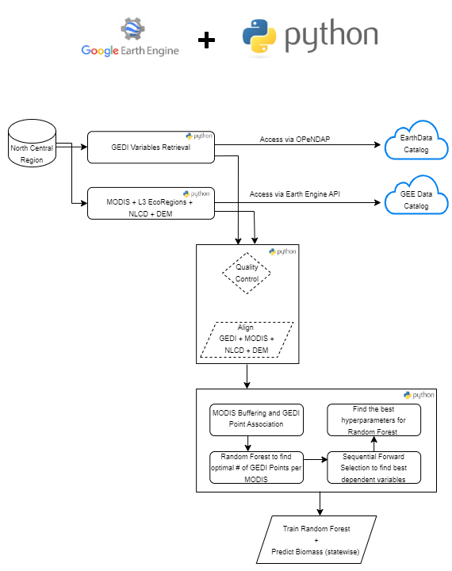

# Ecosystem Transformations

Workflow:
We use a combination of tools. 
- For long running/batch tasks, we used Python (+ Google Earth Engine (GEE) Python SDK)
- For final visualization tasks, Google Earth Engine was used

    

----

<h1>Steps:</h1>

1. Pull Raw GEDI L4A data (in CSVs) for a pre-defined region (In our case we pulled L4A data for North Central Region's Forests) - [Download_GEDI_L4A.ipynb](https://github.com/earthlab/NC_RISCC_eco_trans/blob/main/notebooks/Download_GEDI_L4A.ipynb)
2. Convert the pulled GEDI L4A data to a workable shapefile format. Upload this shape file to GEE. Subsequent code will require the .shp file present on your GEE account - [Convert_And_Merge_SHP.ipynb](https://github.com/earthlab/NC_RISCC_eco_trans/blob/main/notebooks/Convert_And_Merge_SHP.ipynb)
3. Now we have a .shp file of pointwise AGBD values along with other GEDI L4A variables (solar elevation, l4_quality_flag, degrade_flag etc.). We will now map these pointwise GEDI values (~25m) to their corresponding MODIS data (~500m) and NASA DEM data (~30m). - [Map_Gedi_Modis.ipynb](https://github.com/earthlab/NC_RISCC_eco_trans/blob/main/notebooks/Map_Gedi_Modis.ipynb)
4. We now have the mapped data between GEDI and Modis Data/Indices. This data is actually region/patch, hence we have thousands of CSV files at this point. Merge these individual CSVs to one single CSV for convenience 
5. We will now start modelling our data. The first part of modelling is to find "How many GEDI L4A pixels are worth considering per MODIS pixel?" and "What are the most important features in order to predict biomass?" and "What is the ideal set of hyperparameters for our model?" - ([Feature_SelectionBulk_Overlap.ipynb](https://github.com/earthlab/NC_RISCC_eco_trans/blob/main/notebooks/Feature_SelectionBulk_Overlap.ipynb), [HyperparameterOpt_RF.ipynb](https://github.com/earthlab/NC_RISCC_eco_trans/blob/main/notebooks/HyperparameterOpt_RF.ipynb), [Train_RF.ipynb](https://github.com/earthlab/NC_RISCC_eco_trans/blob/main/notebooks/Train_RF.ipynb))
6. We are now ready for prediction. Download the state wise data - [Download_Statewise_MODIS.ipynb](https://github.com/earthlab/NC_RISCC_eco_trans/blob/main/notebooks/Download_Statewise_MODIS.ipynb)
7. Now predict on state wise data with - [Statewise_Prediction.ipynb](https://github.com/earthlab/NC_RISCC_eco_trans/blob/main/notebooks/Statewise_Prediction.ipynb)