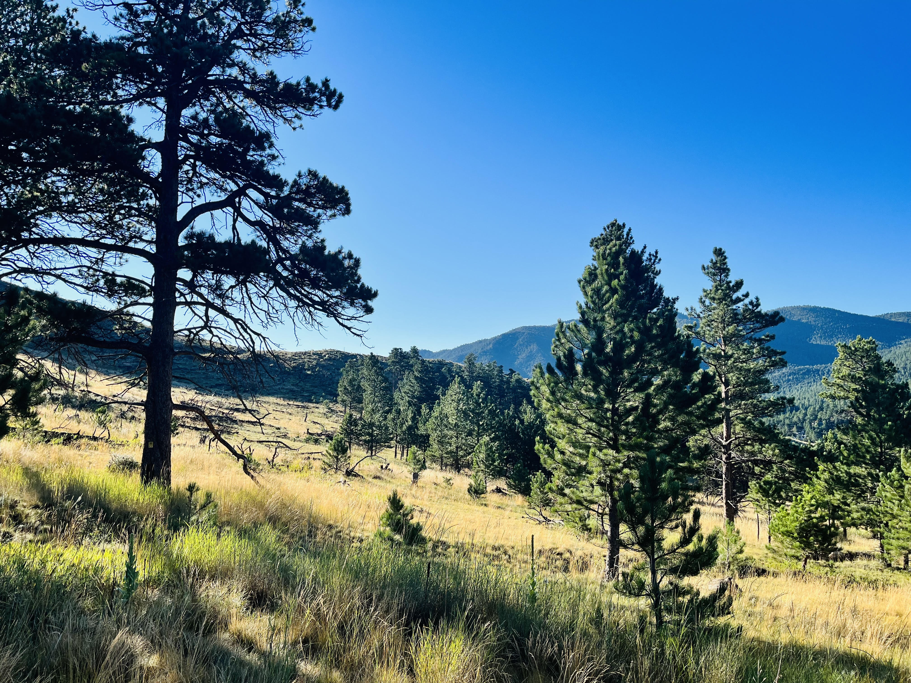
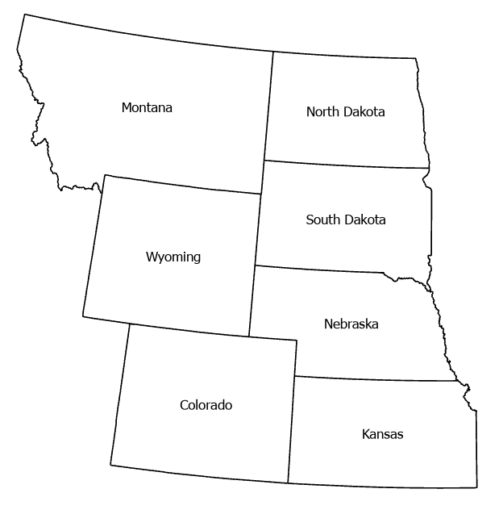
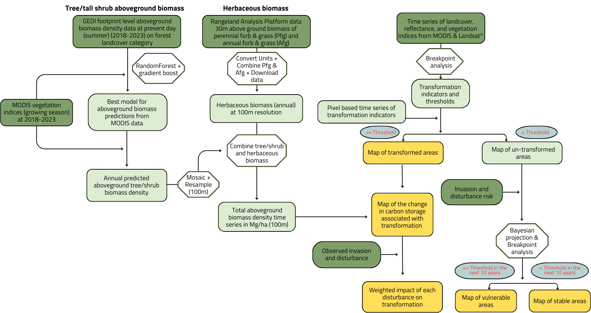

Forest to grass or shrubland transitions are emerging as a major ecological risk across north central U.S. forest systems, particularly in dry and disturbance prone forests of Montana, Wyoming, and Colorado and in the fragmented forest - grassland ecotones extending from North Dakota to Kansas. The literature shows that warming, drought, high severity fire, and regeneration failure can push these systems beyond recovery thresholds, leading to persistent nonforest states. Because forests typically store more carbon than shrublands or grasslands, these transitions can reduce long term carbon storage, weaken regional carbon sinks, and alter ecosystem resilience. Quantifying where, how fast, and under what conditions these transitions occur, where are the areas vulnerable for near future transformations, and what is the impact on aboveground carbon storage are therefore critical for carbon accounting, climate adaptation, and land management.

## Study Area

## Methods

## Findings

### References

### Funding

### Team

