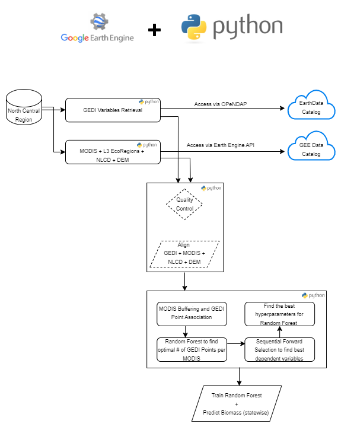

Forest to grass or shrubland transitions are emerging as a major ecological risk across north central U.S. forest systems, particularly in dry and disturbance prone forests of Montana, Wyoming, and Colorado and in the fragmented forest - grassland ecotones extending from North Dakota to Kansas. The literature shows that warming, drought, high severity fire, and regeneration failure can push these systems beyond recovery thresholds, leading to persistent nonforest states. Because forests typically store more carbon than shrublands or grasslands, these transitions can reduce long term carbon storage, weaken regional carbon sinks, and alter ecosystem resilience. Quantifying where, how fast, and under what conditions these transitions occur, where are the areas vulnerable for near future transformations, and what is the impact on aboveground carbon storage are therefore critical for carbon accounting, climate adaptation, and land management.

## Study Area

## Methods
The following workflow summarizes the four phases we developed in this study.

The study consists of four phases.

### Phase 1 - Forest Biomass Prediction:
Develop a time series of forest biomass (500 m resolution) using GEDI footprint based biomass density data and MODIS vegetation index time series. The full workflow and the codes used for this phase can be found [here](notebooks). The resulsts are provided per state time series from 2003-2017.
The predicted biomass' raster be found statewise at this [Drive Folder](https://drive.google.com/drive/folders/18dncALa1bh-jHGAmduPqJ_tDuCAAzcDp?usp=drive_link).

### Phase 2 - Combining Rangeland and Forest Biomass data:
See [Methods_Biomass_Dataset.docx](docs/Methods_Biomass_Dataset.docx) for detailed methods and references

We included rangeland biomass data to cover the non-forest biomass of the seven states using the data provided by [Rangland Analysis Platform](https://rangelands.app/rap/?biomass_t=herbaceous&ll=39.0000,-98.0000&z=5&biomass_v=true). 

### Phase 3 - Predicting Ecosystem Transitions:
Using [LCMAP](https://www.usgs.gov/data/lcmap-land-cover-and-land-change-sample-data) land cover data we identified the areas already transformed (1990-2017). Using already transformed pixels and their vegetation index time series we detected the break points and their lead time to recognize any transformation early warning indicators.
Added climate variables including precipitation, temperature (time series for precipitation temperature data), fire risk and grass invasion risk data to evaluate the impact of these drivers on incrasing/decreasing transformations and produced maps of areas vulnerable for transformation within next 15 years. 

### Phase 4 - Predicting Biomass Change in Transition Areas:
Using our biomass maps and transformed data we estimated the biomass impact due to transformations and their trends.

## Findings

### References

### Funding

### Team

